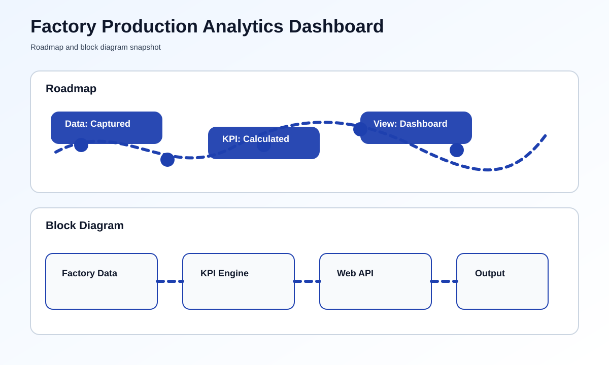

# Factory Production Analytics Dashboard


## Overview
This project opens a local dashboard that summarizes factory production metrics such as output, downtime, defects, and efficiency. It is built to run in a browser with no external dependencies.

## What You Need
- Python 3 installed on your computer
- A web browser

## How To Run This Project
### Step-by-Step Setup
1. Open this folder.
2. Open the file named [main.py](main.py).
3. Run the script.
4. Open the browser address shown in the terminal.
5. Read the live production dashboard.

### Commands To Run
```bash
python main.py
```

## What You Should See
- Production output count
- Downtime minutes
- Defect count
- Overall efficiency percentage

## Roadmap & Block Diagram


## Possible Enhancements
- Shift-wise analytics
- CSV export
- Historical graphs
- Machine-level breakdown

## GitHub Profile Summary
A clean factory dashboard project that presents production data in a simple browser view.
