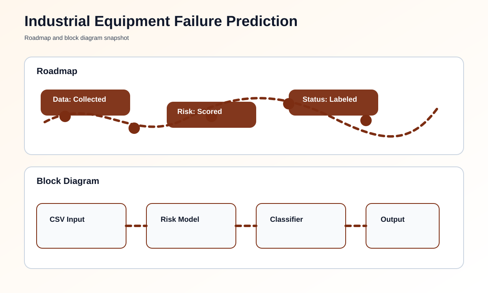

# Industrial Equipment Failure Prediction using Sensor Data


## Overview
This project reads sensor values and calculates a basic failure risk level for industrial equipment. It is designed as a simple, beginner-friendly starter that can run with sample data or a CSV file.

## What You Need
- Python 3 installed on your computer
- Optional CSV file named `sensor_data.csv`

## How To Run This Project
### Step-by-Step Setup
1. Open this folder.
2. Open the file named [main.py](main.py).
3. If you have a sensor CSV file, place it in the folder.
4. Run the script.
5. Read the failure risk result in the terminal.

### Commands To Run
```bash
python main.py
```

You can also use a custom CSV file:
```bash
python main.py --data-file sensor_data.csv
```

## What You Should See
- Sensor readings
- Failure risk score
- Status label such as low, medium, or high risk

## Roadmap & Block Diagram


## Possible Enhancements
- Live sensor streaming
- Alert notifications
- Cloud storage of readings
- Maintenance scheduling suggestions

## GitHub Profile Summary
A practical sensor-based prediction project that highlights how industrial failure risk can be estimated from data.
