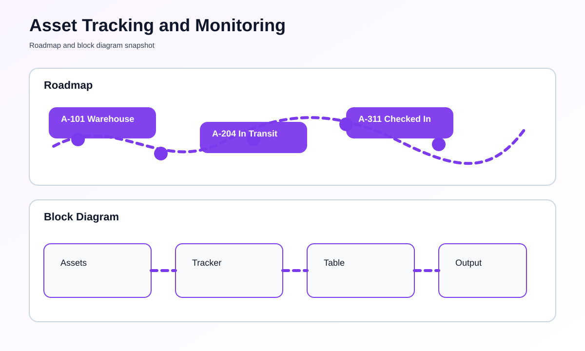

# IoT-Based Asset Tracking and Monitoring System


## Overview
This project shows a simple asset tracking and monitoring dashboard. It keeps track of assets, their location, and their status in a browser window.

## What You Need
- Python 3 installed on your computer
- A web browser
- No special hardware is required for the demo mode

## How To Run This Project
### Step-by-Step Setup
1. Open this folder.
2. Open the file named [main.py](main.py).
3. Run the script.
4. Open the browser address shown in the terminal.
5. Use the buttons to simulate movement or status changes.

### Commands To Run
```bash
python main.py
```

## What You Should See
- Asset list with current location
- Status indicators such as in transit or in warehouse
- Manual action buttons

## Roadmap & Block Diagram


## Possible Enhancements
- GPS-based tracking
- QR or RFID integration
- Loss alert notifications
- Route history and map view

## GitHub Profile Summary
A simple but useful asset tracking dashboard that demonstrates location-based monitoring in a browser.
