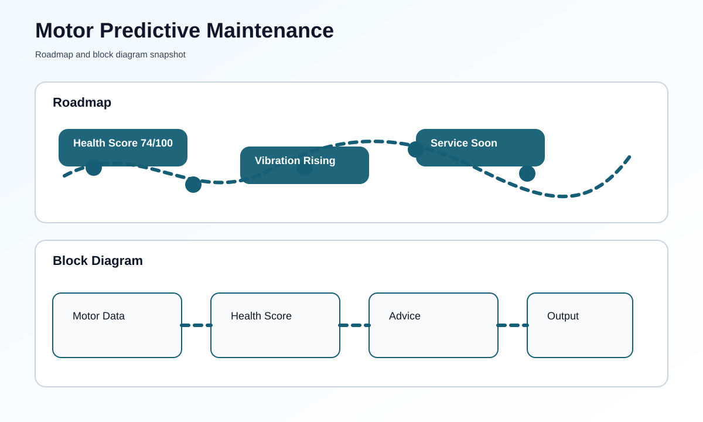

# Predictive Maintenance System for Industrial Motors


## Overview
This project simulates a predictive maintenance workflow for an industrial motor. It reads sensor values, calculates a health score, and prints maintenance advice in a simple format that is easy to follow.

## What You Need
- Python 3 installed on your computer
- No special hardware is required for the demo mode
- Optional CSV file named `motor_data.csv`

## How To Run This Project
### Step-by-Step Setup
1. Open this folder.
2. Open the file named [main.py](main.py).
3. If you have a CSV file, place it in the same folder as `motor_data.csv`.
4. Run the script.
5. Read the health score and maintenance suggestion in the terminal.

### Commands To Run
```bash
python main.py
```

You can also use a custom CSV file:
```bash
python main.py --data-file motor_data.csv
```

## What You Should See
- Motor sensor readings
- Health score percentage
- Maintenance advice such as normal, watch, or service soon

## Roadmap & Block Diagram


## Possible Enhancements
- Live sensor integration
- Email or SMS alerts
- Web dashboard
- Historical trend charts

## GitHub Profile Summary
A beginner-friendly predictive maintenance project that turns motor sensor data into simple service recommendations.
