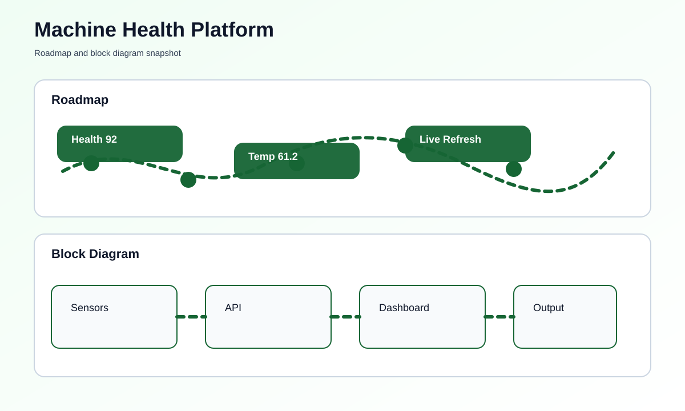

# Real-Time Machine Health Monitoring Platform


## Overview
This project runs a small local dashboard that shows machine health values in real time. It is designed for a simple demo setup where a user can open a browser and watch the status update automatically.

## What You Need
- Python 3 installed on your computer
- A web browser
- No special hardware is required for the demo mode

## How To Run This Project
### Step-by-Step Setup
1. Open this folder.
2. Open the file named [main.py](main.py).
3. Run the script.
4. Open the browser address shown in the terminal.
5. Watch the live machine health values update on the page.

### Commands To Run
```bash
python main.py
```

## What You Should See
- Machine health score
- Temperature and vibration values
- Pressure and load indicators
- Automatic refresh in the browser

## Roadmap & Block Diagram


## Possible Enhancements
- MQTT integration
- Real sensor input from IoT hardware
- Alerts for abnormal values
- Historical trend graphs

## GitHub Profile Summary
A practical monitoring platform that demonstrates real-time machine condition tracking in a browser.
