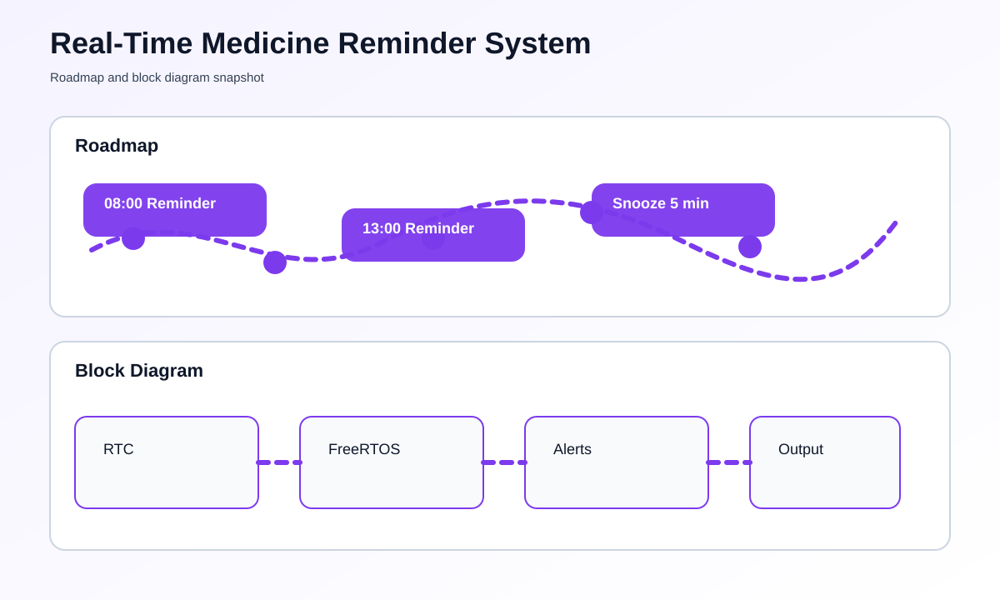

# Real-Time Medicine Reminder System using ESP32 and FreeRTOS


## Overview
This project uses an ESP32 and FreeRTOS to deliver reliable medicine reminders at exact times. It is designed for patients, caregivers, and home-health use cases where missed doses can be costly.

## At a Glance
- Board: ESP32 development board
- Timing: FreeRTOS tasks plus optional RTC module
- Alerts: Buzzer, display, and optional mobile notifications
- Input: Buttons for setup, snooze, and acknowledge

## Problem Statement
Medication reminders must be dependable and easy to use. A simple delay-based sketch is not enough when multiple reminders, user input, and alert timing must happen together. FreeRTOS makes those actions predictable.

## Key Features
- Multiple medicine schedules per day
- Precise reminder triggering
- Snooze and acknowledge controls
- Visual and audible alerts
- Optional cloud or phone-based reminders

## Hardware Requirements
- ESP32 development board
- DS3231 or similar RTC module
- Buzzer or speaker
- OLED/LCD display
- Push buttons for control
- Optional Wi-Fi or Bluetooth support

## Software Requirements
- Arduino IDE with ESP32 package
- FreeRTOS task scheduling
- MQTT, Firebase, or Blynk if remote sync is used

## How To Run This Project
This project is designed for a non-technical user to follow by moving through the steps slowly and in order.

### Step-by-Step Setup
1. Install Arduino IDE on your computer.
2. Open Arduino IDE and install the ESP32 board package from Boards Manager.
3. Install the `RTClib` library from the Library Manager.
4. Open the file named [main.ino](main.ino).
5. Connect the RTC module, buzzer, and buttons to the ESP32 exactly as described in your wiring plan.
6. Plug the ESP32 into your computer with a USB cable.
7. Select the correct ESP32 board and COM port in Arduino IDE.
8. Click Upload.
9. Open Serial Monitor to confirm the time and reminder messages.
10. Set the RTC time if needed, then wait for the reminder time to test it.

### Command-Line Method
If you want to use commands, run these from the project folder after installing `arduino-cli`:

```bash
arduino-cli core update-index
arduino-cli core install esp32:esp32
arduino-cli lib install "RTClib"
arduino-cli compile --fqbn esp32:esp32:esp32 "d:/Puthusus/IOT Projects/real-time-medicine-reminder-system-esp32-freertos"
arduino-cli upload -p COM3 --fqbn esp32:esp32:esp32 "d:/Puthusus/IOT Projects/real-time-medicine-reminder-system-esp32-freertos"
```

Replace `COM3` with the actual port on your computer.

### What You Should See
- The serial monitor shows the current time.
- The buzzer sounds when a reminder time matches.
- The snooze and acknowledge buttons control the reminder.

## How It Works
1. The user configures medicine times and dosage details.
2. FreeRTOS separates timing, alerting, and user interaction into tasks.
3. When the current time matches a schedule, the reminder activates.
4. The buzzer and display notify the user.
5. The alert remains active until the user acknowledges it.

## Roadmap & Block Diagram


## Possible Enhancements
- Caregiver monitoring dashboard
- Dose history logging
- Battery backup for uninterrupted reminders
- Voice reminders
- Multiple user profiles

## GitHub Profile Summary
This is a dependable embedded health project that highlights real-time scheduling, user interaction, and system reliability with ESP32 and FreeRTOS.
