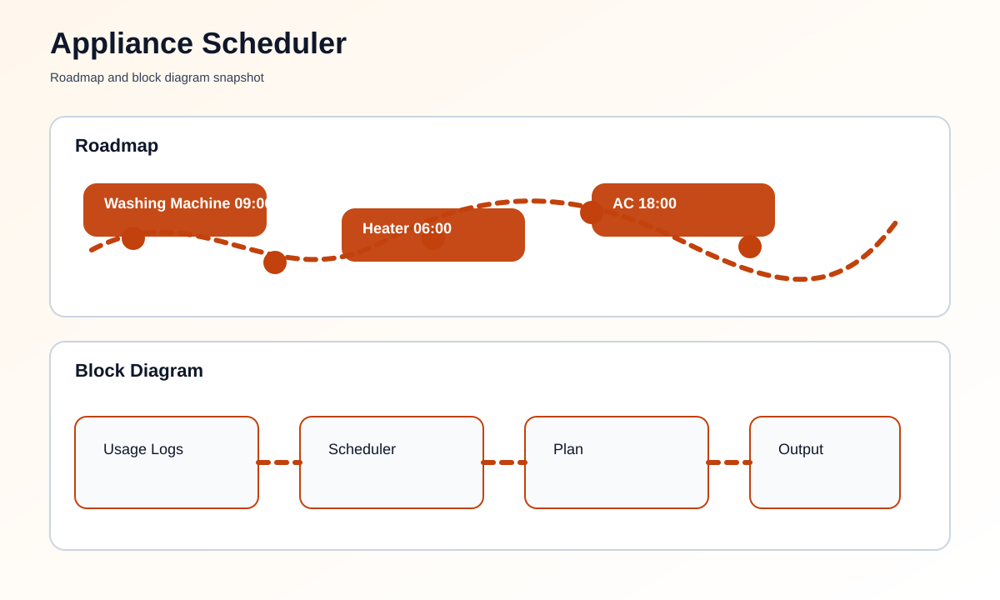

# Smart Appliance Scheduler using Machine Learning


## Overview
This project learns from past appliance usage and suggests a better time to run appliances such as washing machines, water heaters, or air conditioners.

## At a Glance
- Input: Historical appliance usage logs
- Output: Suggested next run time
- File to run: [main.py](main.py)

## What You Need
- Python 3 installed on your computer
- Optional CSV file with appliance usage history

## How To Run This Project
This is a simple Python project and does not need special hardware.

### Step-by-Step Setup
1. Install Python.
2. Open this folder.
3. Open [main.py](main.py).
4. If you have a usage history file, place it in the folder.
5. Run the script.
6. Read the suggested schedule in the terminal.

### Commands To Run
```bash
python main.py
```

If you want to use your own usage history, add a CSV file named `usage_history.csv` with appliance, hour, and day columns.
You can also pass a custom file with `--history-file`.
If no CSV file is present, the project still runs with sample history.

## What You Should See
- Learned appliance usage pattern
- Suggested run hour for each appliance
- A simple schedule summary

## Roadmap & Block Diagram


## Possible Enhancements
- Mobile notifications before the predicted run time
- Room-by-room appliance scheduling
- Cloud dashboard for all devices
- More detailed learning from daily habits

## GitHub Profile Summary
A beginner-friendly machine learning style project that helps plan appliance usage more intelligently.
