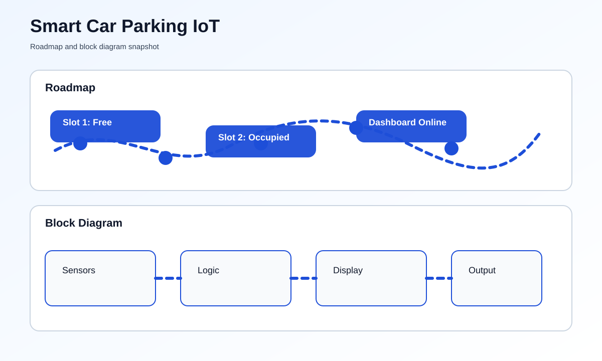

# Smart Car Parking IoT


## Overview
Smart Car Parking IoT is a real-time parking occupancy system built around an ESP32. It detects slot availability, publishes the status to a dashboard, and helps drivers and operators reduce search time in busy parking areas.

## At a Glance
- Board: ESP32 or compatible Wi-Fi microcontroller
- Sensors: Ultrasonic or IR sensors per parking bay
- Output: Display, LED indicators, or web dashboard
- Connectivity: Wi-Fi with MQTT, Blynk, or custom HTTP dashboard

## Problem Statement
Parking lots often waste space and time because drivers do not know which bays are free. This project solves that by continuously monitoring each slot and exposing the result in a readable, connected format.

## Key Features
- Real-time slot occupancy detection
- Live free/occupied status updates
- Optional reserved slot logic
- Local display and remote dashboard support
- Optional mobile alerts when a slot becomes available

## Hardware Requirements
- ESP32 development board
- Ultrasonic or IR sensors
- LCD, OLED, LEDs, or a web dashboard
- Jumper wires and power supply
- Optional buzzer or servo-based gate control

## Software Requirements
- Arduino IDE or PlatformIO
- MQTT, Blynk, or a custom web stack
- HTML/CSS/JavaScript for a dashboard if needed

## How To Run This Project
If you are not comfortable with code, follow the steps below in order. The Arduino IDE method is the easiest.

### Step-by-Step Setup
1. Install the Arduino IDE on your computer.
2. Open Arduino IDE, then add ESP32 support from the Boards Manager.
3. Open the file named [main.ino](main.ino).
4. Update the Wi-Fi name and password inside the sketch.
5. Check the sensor pin numbers and LED pin numbers so they match your wiring.
6. Connect the ESP32 board to your computer with a USB cable.
7. In Arduino IDE, choose the correct ESP32 board and the correct COM port.
8. Click Upload.
9. Open Serial Monitor to see the Wi-Fi IP address.
10. Type that IP address into your browser to view the parking status page.

### Command-Line Method
If you prefer commands, use these from the project folder after installing `arduino-cli`:

```bash
arduino-cli core update-index
arduino-cli core install esp32:esp32
arduino-cli compile --fqbn esp32:esp32:esp32 "d:/Puthusus/IOT Projects/smart-car-parking-iot"
arduino-cli upload -p COM3 --fqbn esp32:esp32:esp32 "d:/Puthusus/IOT Projects/smart-car-parking-iot"
```

Replace `COM3` with the port name shown on your computer. If you use macOS or Linux, the port will look different.

### What You Should See
- The ESP32 connects to Wi-Fi.
- The serial monitor shows the IP address.
- The web page shows which parking slots are free or occupied.

## How It Works
1. Each parking bay is fitted with a sensor.
2. The ESP32 reads the sensor output at regular intervals.
3. Occupied and free states are calculated from the sensor data.
4. The current status is shown on a display or sent to the cloud.
5. Drivers can check availability before entering the lot.

## Roadmap & Block Diagram


## Possible Enhancements
- QR-based entry and exit tracking
- Automated gate control
- Parking duration and fee calculation
- Mobile booking integration
- Historical occupancy analytics

## GitHub Profile Summary
This project is a smart-city style IoT build that demonstrates sensing, connectivity, and clean real-time visualization for parking management.
