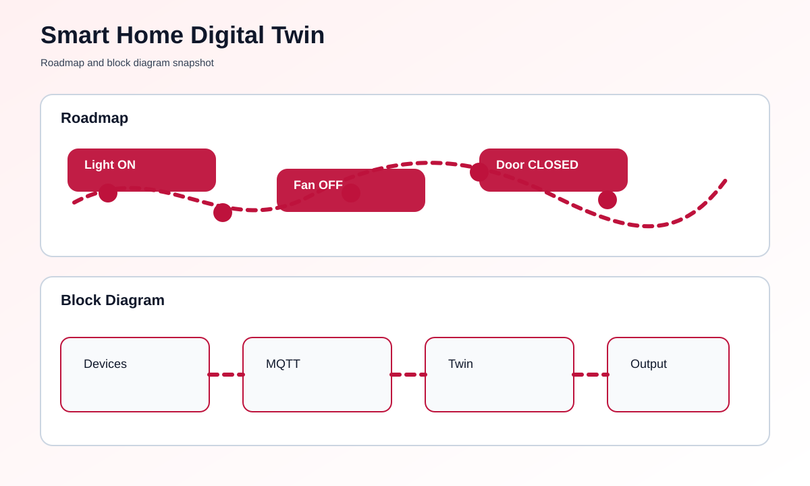

# Smart Home Digital Twin using MQTT


## Overview
This project shows a simple smart home digital twin that receives device updates through MQTT and displays the current home state in a readable way. It is useful for understanding how a real home system can be mirrored in software.

## At a Glance
- Input: MQTT messages from sensors or smart devices
- Output: Live digital twin status in the terminal
- Optional broker: Public or local MQTT broker
- File to run: [main.py](main.py)

## What You Need
- Python 3 installed on your computer
- An MQTT broker such as Mosquitto or HiveMQ
- Optional: `paho-mqtt` package for live MQTT connection

## How To Run This Project
Follow these steps if you are new to coding.

### Step-by-Step Setup
1. Install Python on your computer.
2. Open this project folder.
3. Open the file named [main.py](main.py).
4. If you want live MQTT updates, install the MQTT package.
5. Run the script.
6. Send MQTT messages to the topic shown in the file.
7. Watch the digital twin update in the terminal.

### Commands To Run
```bash
pip install paho-mqtt
python main.py
```

If you do not install `paho-mqtt`, the project still runs in simulation mode.
If the MQTT broker is unavailable, the script automatically falls back to simulation mode.

## What You Should See
- A home dashboard printed in the terminal
- Updated device values such as lights, fan, and temperature
- MQTT messages reflected in the twin when live data arrives

## Roadmap & Block Diagram


## Possible Enhancements
- Web dashboard with charts
- Room-by-room digital twin view
- Real-time mobile notifications
- Cloud storage for device history

## GitHub Profile Summary
A beginner-friendly MQTT project that demonstrates how a live smart home state can be mirrored in software.
