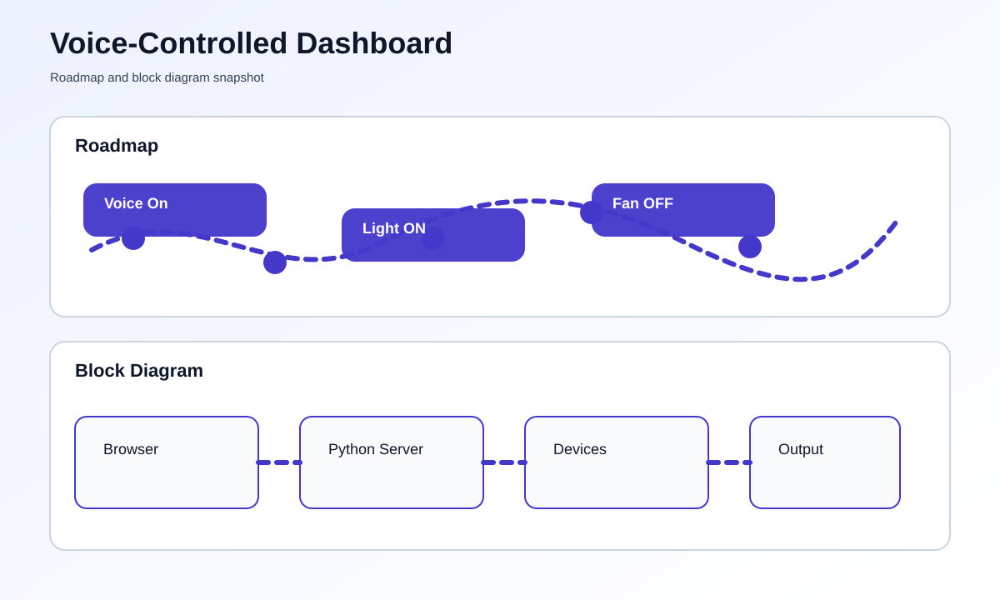

# Voice-Controlled Home Automation Dashboard


## Overview
This project gives you a simple home automation dashboard that can be controlled by voice inside the browser. It is useful for lights, fans, and other small home devices connected to a local control system.

## At a Glance
- Interface: Local web dashboard
- Voice control: Browser speech recognition
- File to run: [app.py](app.py)

## What You Need
- Python 3 installed on your computer
- A modern browser such as Chrome or Edge
- Microphone access if you want to use voice commands

## How To Run This Project
This project runs locally on your computer and opens in a browser.

### Step-by-Step Setup
1. Install Python.
2. Open this folder.
3. Open the file named [app.py](app.py).
4. Run the script.
5. Open the browser link shown in the terminal.
6. Click the voice button and speak a command.
7. Use the on-screen buttons if you do not want to use voice.

### Commands To Run
```bash
python app.py
```

The dashboard also includes normal buttons and a manual command box, so it still works even if voice recognition is not available in your browser.

## What You Should See
- A dashboard with device cards
- Buttons to control devices
- A microphone button for voice commands
- Live status updates on the page

## Roadmap & Block Diagram


## Possible Enhancements
- MQTT device integration
- Smart speaker support
- Mobile-friendly layout
- Room-specific controls

## GitHub Profile Summary
A simple but practical voice-driven dashboard that shows how browser voice control can manage home devices.
