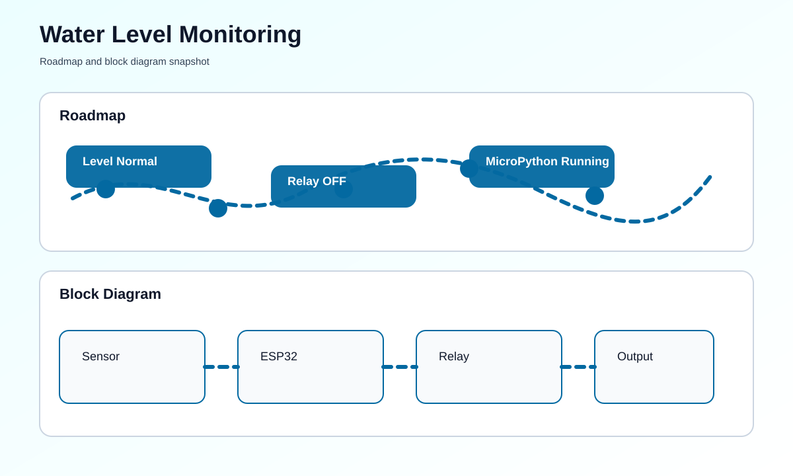

# Water Level Monitoring System using ESP32 and MicroPython


## Overview
This project uses an ESP32 and MicroPython to monitor water level conditions in tanks or reservoirs. It provides real-time status updates and can trigger alerts or control actions when levels become unsafe.

## At a Glance
- Board: ESP32 development board
- Sensor: Water level sensor or ultrasonic sensor
- Output: LEDs, buzzer, display, or relay
- Development: MicroPython with Thonny or similar IDE

## Problem Statement
Water tanks need a simple and reliable way to avoid overflow and dry-run conditions. This project continuously measures the water level and reports whether the system is in a safe range.

## Key Features
- Continuous water level sensing
- Threshold-based alerts
- Audible and visual warnings
- Optional pump automation
- Clean MicroPython implementation

## Hardware Requirements
- ESP32 development board
- Water level or ultrasonic sensor
- Buzzer or indicator LEDs
- OLED/LCD display
- Relay or pump control module
- Jumper wires and power supply

## Software Requirements
- MicroPython firmware
- Thonny IDE or another MicroPython editor
- Optional MQTT or web server for remote status

## How To Run This Project
This version is meant to be easy to start, even if you have never used an ESP32 before.

### Step-by-Step Setup
1. Install Thonny on your computer.
2. Connect the ESP32 board to your computer with a USB cable.
3. Flash or select the MicroPython firmware for the ESP32 in Thonny.
4. Open the file named [main.py](main.py).
5. Check the trigger pin, echo pin, LED pins, buzzer pin, and relay pin to match your wiring.
6. Save the file to the ESP32 as `main.py`.
7. Click Run in Thonny, or unplug and reconnect the board after saving.
8. Watch the output in Thonny or the serial console.

### Command-Line Method
If you prefer commands, install `mpremote` first and then use these commands:

```bash
pip install mpremote
mpremote connect COM3 fs cp main.py :main.py
mpremote connect COM3 reset
```

Replace `COM3` with the port used by your ESP32.
If you run the file on a normal computer, it uses a built-in simulation mode and prints fake sensor readings.

### What You Should See
- The ESP32 prints the measured water distance.
- The green LED turns on when the level is normal.
- The red LED and buzzer turn on when the level is too low or too high.
- The relay can turn on if you want automatic pump control.

## How It Works
1. The sensor measures the water level or distance to the surface.
2. MicroPython reads the sensor at fixed intervals.
3. The ESP32 compares the reading with preset thresholds.
4. The current status is shown on the display and alerts are triggered if needed.
5. A pump or relay can be used for automatic control.

## Roadmap & Block Diagram


## Possible Enhancements
- Cloud logging of water trends
- Mobile dashboard support
- Battery-backed remote monitoring
- Multiple tank support
- SMS or voice alerts through an external service

## GitHub Profile Summary
This is a clean MicroPython IoT project that demonstrates practical sensing, alerting, and control for water management.
